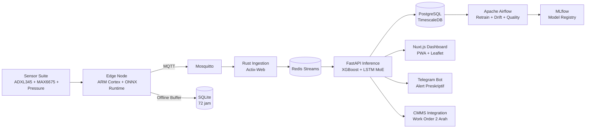

<div align="center">

# ⛏️ PRATYAKSA

### KIDECO INNOVATION CHALLENGE 2026 — Tahap Seleksi

**Predictive Analytics & Traceability for Heavy Asset Condition Surveillance and Actualization**

Sistem AIoT Predictive dan Prescriptive Maintenance untuk Armada Alat Berat Tambang Batubara di Pasir Mine PT. Kideco Jaya Agung


**Tim Oryphem — Politeknik Negeri Samarinda**

</div>

---

## 📋 Daftar Isi

- [Identitas Tim](#-identitas-tim)
- [Ringkasan Eksekutif](#-ringkasan-eksekutif)
- [Masalah & Solusi](#-masalah--solusi)
- [Arsitektur Sistem](#-arsitektur-sistem)
- [Fitur Utama](#-fitur-utama)
- [Skenario Nyata (8 Tahap Alur Kerja)](#-skenario-nyata-8-tahap-alur-kerja)
- [Model Machine Learning](#-model-machine-learning)
- [Komponen IoT](#-komponen-iot)
- [Tech Stack](#-tech-stack)
- [Cara Memulai (Quick Start)](#-cara-memulai-quick-start)
- [Daftar Service](#-daftar-service)
- [Daftar Endpoint API](#-daftar-endpoint-api)
- [Testing](#-testing)
- [Struktur Proyek](#-struktur-proyek)
- [Status Prototipe](#-status-prototipe)
- [Roadmap Implementasi](#-roadmap-implementasi)
- [Cara Berkontribusi](#-cara-berkontribusi)
- [Lisensi](#-lisensi)
- [Kontak](#-kontak)

---

## 👥 Identitas Tim

| Jabatan | Nama | NIM | Program Studi | Peran |
|---------|------|:---:|---------------|-------|
| **Ketua** | Baits Rika Saputra | 236651071 | D4 Teknik Informatika Multimedia | *Full Stack Developer* (Website) |
| **Anggota 1** | Virgiawan Prima Rizky | 236652017 | D4 Teknik Informatika Multimedia | *Data & Machine Learning Engineer* |
| **Anggota 2** | Raihan Akbar Ramadhan | 236651032 | D4 Teknik Informatika Multimedia | *UI/UX Designer* |
| **Anggota 3** | Farhan Raditya Al Gazali | 246661036 | D4 Teknik Rekayasa Komputer | *IoT Engineer* |

**Email Tim:** brsaputra14@gmail.com

---

## 📝 Ringkasan Eksekutif

PRATYAKSA adalah platform AIoT terintegrasi yang mengubah pendekatan perawatan armada alat berat tambang dari **reaktif menjadi proaktif**. Sistem memantau kondisi komponen kritis secara *real-time* berbasis arsitektur **Edge-Cloud** dengan representasi **Digital Twin** yang tetap beroperasi penuh bahkan di area *blank spot* terdalam pit Pasir Mine.

**Target Dampak:**

| Metrik | Baseline | Target |
|--------|:--------:|:------:|
| Physical Availability (PA) Armada | 82–85% | **90–93%** |
| Pengurangan *Unplanned Downtime* | — | **30–45%** |
| Efisiensi Biaya Pemeliharaan | — | **20–30%** |
| Potensi Penyelamatan Produksi (50 unit) | — | **USD 8–12 Juta/tahun** |
| Latensi *Alert* di Kabin | — | **<500ms** |

---

## 🧩 Masalah & Solusi

### Masalah

Berdasarkan analisis operasional PT. Kideco Jaya Agung (Company Update FY2025 — PT Indika Energy), terdapat lima permasalahan utama:

| # | Masalah | Dampak Finansial |
|---|---------|:----------------:|
| 1 | **Inefisiensi Preventive Maintenance Berbasis Jadwal** — Komponen kritis terdegradasi lebih cepat dari jadwal PM karena kondisi operasi ekstrem (grade 12%), tetapi sistem tidak mendeteksi hingga terjadi *breakdown* mendadak | Biaya perbaikan darurat 2–5× lebih mahal |
| 2 | **Dampak Finansial Masif dari *Unplanned Downtime*** — Satu excavator berhenti → 5–7 haul truck ikut berhenti. Dalam 8 jam: produksi hilang 400 ton (USD 20.000) + biaya sewa tetap + lembur mekanik | **USD 25.000+ per insiden** |
| 3 | **Tantangan Konektivitas & Kondisi Ekstrem** — Pit Pasir Mine memiliki kedalaman ratusan meter dengan *blank spot* sinyal. Suhu operasi hingga 70°C, getaran konstan 2–5g, debu batubara konsentrasi tinggi | Data tidak reliabel, sensor mati prematur |
| 4 | **Model AI ***Black-Box*** Tidak Terpercaya** — Mekanik tidak percaya pada rekomendasi AI tanpa penjelasan transparan tentang *mengapa* suatu keputusan diambil | Adopsi sistem rendah, kembali ke keputusan manual |
| 5 | **Risiko Keselamatan pada Komponen Kritis** — Ancaman terhadap rekor 43,6 juta jam kerja *LTI Free*: rem blong di grade 12%, kebocoran hidraulik (*loss of steering*), *overheat* mesin berujung kebakaran | Potensi **USD 500.000–2 Juta** per insiden LTI |

### Solusi

PRATYAKSA beroperasi dalam paradigma **Edge-Cloud Continuum** dengan enam lapisan arsitektur:

```
┌─────────────────────────────────────────────────────────────────────────────┐
│ 🌐 LAPISAN 6: MLOps & Continuous Learning                                    │
│     Apache Airflow (weekly retrain + daily drift + daily quality)            │
│     MLflow experiment tracking → zero-downtime model promotion              │
├─────────────────────────────────────────────────────────────────────────────┤
│ 🖥️ LAPISAN 5: Applications & Interfaces                                     │
│     Nuxt.js Dashboard (PWA), Telegram Bot, CMMS Integration (2 arah)       │
├─────────────────────────────────────────────────────────────────────────────┤
│ 💾 LAPISAN 4: Data & Model Storage                                          │
│     PostgreSQL + TimescaleDB (time-series), Redis Cache, MLflow Registry    │
├─────────────────────────────────────────────────────────────────────────────┤
│ 🧠 LAPISAN 3: AI & Analytics Engine                                         │
│     FastAPI — XGBoost (anomaly) + LSTM MoE (RUL) + SHAP + Drift Detection   │
│     Physics-Informed AI: asymmetric loss + PINN penalty + MC Dropout        │
├─────────────────────────────────────────────────────────────────────────────┤
│ 📡 LAPISAN 2: Data Transport & Ingestion                                     │
│     Rust (Actix-Web) MQTT/HTTP ingestion → Redis Streams (consumer group)   │
│     Mobile Hotspot 4G/LTE di kabin (tanpa tower gateway eksternal)          │
├─────────────────────────────────────────────────────────────────────────────┤
│ 🔧 LAPISAN 1: IoT & Edge Computing                                           │
│     Sensor ruggedized (IP67) + Edge Node (ARM Cortex) + ONNX Runtime        │
│     Buffer lokal 72 jam → operasi penuh di area blank spot                 │
└─────────────────────────────────────────────────────────────────────────────┘
```

---

## 🏛️ Arsitektur Sistem



### Alur Data Sistem

```
Sensor (6 titik/unit) → Edge Node (ONNX, <500ms)
    ↓ jika online
Mobile Hotspot 4G/LTE → Rust Ingestion → Redis Streams
    ↓ jika offline
Buffer SQLite 72 jam → sinkronisasi asinkron saat sinyal pulih
    ↓
FastAPI Inference:
  ├─ XGBoost (3-class anomaly)
  ├─ LSTM MoE (RUL hierarkis)
  ├─ Digital Twin (physics cross-check)
  ├─ SHAP Explainability
  └─ Drift Detection (Z-score real-time)
    ↓
TimescaleDB (sensor + prediksi) ↔ Redis Cache (result:{asset_id}, TTL 1h)
    ↓
Nuxt.js Dashboard (WebSocket) | Telegram Bot | CMMS (2 arah)
```

### Port yang Digunakan

| Service | Host Port |
|---------|:---------:|
| FastAPI Inference API | **6000** |
| Grafana Dashboard | **6001** |
| MLflow Tracking | **6050** |
| Airflow Webserver | **6080** |
| Prometheus | **6090** |
| Mosquitto MQTT | **6883** |
| Redis | **6379** |
| PostgreSQL (TimescaleDB) | **5432** |

---

## ✨ Fitur Utama

| No | Fitur | Deskripsi |
|:--:|-------|-----------|
| 1 | **Edge Anomaly Detection (Offline-Capable)** | Deteksi anomali *real-time* di Edge Gateway lokal tanpa internet. Model ONNX berjalan di ARM Cortex-A53, memberikan *alert* audio-visual di kabin operator dalam **<500ms**. Vital untuk keselamatan di area *blank spot* pit terdalam. |
| 2 | **RUL Prediction — LSTM MoE** | Model LSTM Mixture of Experts memprediksi sisa umur komponen kritis (hidraulik, transmisi, bearing, mesin) dalam satuan jam pada **tiga level hierarki**: subsistem, komponen, dan part. Output dilengkapi *confidence interval*. |
| 3 | **SHAP Explainability Dashboard** | Memvisualisasikan kontribusi setiap sensor terhadap prediksi dalam bentuk *waterfall plot*. Mekanik dapat melihat parameter mana yang mendorong skor risiko naik — membuat AI bersifat ***white-box***. |
| 4 | **Prescriptive Recommendation Engine** | Menghasilkan rekomendasi teknis komplet: jenis tindakan, *part number* spesifik, ketersediaan stok di *workshop*, estimasi jam kerja, biaya material, dan perbandingan biaya vs perbaikan darurat. |
| 5 | **Fleet Health Dashboard** | Tampilan terpusat berbasis Leaflet: peta GPS *real-time* dengan *color-coding* risk score (hijau/kuning/merah), KPI summary, dan status sinkronisasi Edge Node. |
| 6 | **CMMS & Telegram Integration** | Sinkronisasi dua arah — rekomendasi otomatis membuat *work order* di CMMS, stok *spare part* dikueri *real-time*, notifikasi ke Telegram grup mekanik. Mekanik konfirmasi langsung dari Telegram. |

---

## 🎬 Skenario Nyata (8 Tahap Alur Kerja)

**Unit:** Haul Truck HD785-7 (ID: HT-KDC-047) — Pompa hidraulik mulai menunjukkan degradasi di jalur *hauling* shift malam.

| Tahap | Komponen | Aksi | Latensi |
|:-----:|----------|------|:-------:|
| **1** | Sensor *Acquisition* | 6 sensor ruggedized (IP67) membaca: getaran bearing 3,8g (↑ dari 2,1g), suhu oli 94°C (↑ dari 78°C), tekanan *discharge* 310 bar (↓ dari 340 bar) | 15 detik/sample |
| **2** | *Edge Processing* | ONNX Runtime di ARM Cortex-A53 mengklasifikasikan sebagai **WARNING**. Lampu kuning di display kabin menyala | **<500ms** |
| **3** | *Transmission & Backhaul* | Saat truck naik ke area bersinyal, data 30 menit terakhir dari buffer lokal terkirim otomatis via Mobile Hotspot 4G | Asinkron |
| **4** | *Ingestion & Transport* | Rust (Actix-Web) memvalidasi 37 parameter, menolak data kotor, menulis ke Redis Streams | <10ms |
| **5** | *Cloud Analytics* | XGBoost → WARNING (prob 0,73). LSTM MoE → RUL pompa: **41 jam tersisa** (CI: 35–48 jam). Digital Twin cross-check | <500ms |
| **6** | *Prescriptive Engine* | SHAP: top-3 penyebab = partikel logam oli (+0,34), tekanan *discharge* (-0,28), vibrasi bearing (+0,21). Rekomendasi: ganti *seal kit* pompa (Part No. 707-99-57201, stok 3 unit). Biaya material: Rp 4,2 juta. **Potensi penghematan vs darurat: Rp 87 juta** | Otomatis |
| **7** | *Action & Notification* | Dashboard supervisor *update* via WebSocket. Telegram Bot kirim ke grup mekanik. Mekanik konfirmasi via Telegram | Real-time |
| **8** | *Orchestration & Feedback Loop* | Data aktual kondisi pompa (67% aus) diumpankan ke *pipeline* training. Airflow retrain Minggu 02.00. MLflow catat MAE turun 8% | Mingguan |

---

## 🤖 Model Machine Learning

### Physics-Informed AI — Tiga Lapisan Kecerdasan Tambahan

1. **Asymmetric Business Loss** — *False negative* (memprediksi sehat padahal akan gagal dalam 10 jam) mendapat penalti gradien **20×** lebih berat dibanding *false positive*
2. **PINN Penalty** — Jika LSTM memprediksi RUL *part* lebih panjang dari RUL *sistem*, model menerima penalti matematis (RUL_part ≤ RUL_komponen ≤ RUL_subsistem)
3. **MC Dropout Uncertainty** — 30 sampel per prediksi. Jika rentang terlalu lebar (10–90 jam), sistem tandai sebagai *"low confidence"* dan tidak kirim rekomendasi palsu

### XGBoost Classifier

| Metrik | Nilai |
|--------|-------|
| Akurasi | **96.85%** |
| Recall CRITICAL | **93.94%** |
| *Silent Misses* | **0** |
| Threshold CRITICAL | 0.29 (F2-optimized) |
| Objective | `multi:softprob` (3 kelas: NORMAL, WARNING, CRITICAL) |

**Top Features** (gain): `acoustic_emission_db` (45.4%), `vibration_z_g` (23.5%), *dropout flags*.

### LSTM MoE — PRATYAKSAExpert

| Komponen | Detail |
|----------|--------|
| **Arsitektur** | 3-layer LSTM (128→64→32) + Dense(16) + MC Dropout(0.1) |
| **Input** | 20 *timesteps* × 37 *features* (*sliding window*) |
| **Output** | RUL_hours + 7 *hierarchical targets* (hydraulic, brake, steering) |
| **MC Dropout** | 30 *forward passes* → *mean* + *std* (*uncertainty*) |
| **Custom Loss** | `asymmetric_loss` — *overprediction penalty* 20× saat RUL < 100h |
| **Expert Heads** | 4 tipe alat: *haul_truck, excavator, bulldozer, wheel_loader* |

**Per-Equipment Performance:**

| Tipe Alat | MAE Test | MAE Critical |
|-----------|:--------:|:------------:|
| Bulldozer D155 | 123h | 11.5h |
| Haul Truck HD785 | 85.4h | 9.3h |
| Excavator PC2000 | 67.2h | 10.4h |
| Wheel Loader WA600 | 87.6h | 9.7h |

### Edge Model (ONNX Runtime)

XGBoost diekspor ke format ONNX (340 KB) untuk inferensi di ARM Cortex-A53 tanpa GPU.

### Digital Twin — Physics Models

| Komponen | Metode | Max RUL |
|----------|--------|:-------:|
| Brake | Payload × grade × distance vs *cumulative work* | 800h |
| Bearing | Vibration threshold (5g → 0h, 3.2g → 12h, 1.4g → 72h) | 500h |
| Hydraulic | *Linear degradation* dari 280 bar nominal (0h saat drop >80 bar) | 500h |

---

## 🔧 Komponen IoT

### Production (Estimasi Biaya Per Unit)

| Komponen | Fungsi | Spesifikasi | Estimasi Biaya |
|----------|--------|-------------|:--------------:|
| MEMS Vibration (ADXL345/ADXL355) | Getaran bearing & transmisi | I2C/SPI, ±16g, IP67 (*custom epoxy*) | Rp 700.000 |
| NTC / K-Type Thermocouple (MAX6675) | Suhu komponen kritis | ±1°C, probe baja, IP67 | Rp 600.000 |
| Piezoresistive Pressure Transducer | Tekanan hidraulik utama | 0–5V, 0–400 bar, IP67 | Rp 900.000 |
| Dielectric Oil Degradation Sensor | Viskositas & kontaminasi logam | RS485 Modbus, update 30 detik | Rp 2.500.000 |
| U-blox NEO-M8N GPS | Posisi *real-time* | NMEA, 1 Hz, akurasi 2–3m | Rp 300.000 |
| Edge Node (RPi Zero 2W / ESP32-S3) | Agregasi sensor + ONNX offline | Quad ARM Cortex / Dual Xtensa, IP65 | Rp 950.000 |
| Nextion HMI 4.3" | Display alarm kabin | UART, *resistive touch*, *conformal coating* | Rp 850.000 |
| 4G Mobile Hotspot (Smartphone/MiFi) | *Backhaul* ke cloud | WiFi 2.4GHz + 4G LTE | Rp 600.000 |
| **TOTAL PER UNIT** | | | **Rp 7.400.000** |

> **Catatan:** Pada skala armada 50 unit, total CAPEX ~Rp 370 juta. ROI eksponensial dalam bulan pertama implementasi.

### Prototipe

| Komponen | Fungsi | Estimasi Biaya |
|----------|--------|:--------------:|
| ESP32-S3-DevKitC-1 | Otak pemrosesan + AI | Rp 120.000–250.000 |
| ADXL345 (4×) | Getaran mesin & transmisi | Rp 480.000–720.000 |
| Water Pressure Sensor SEN0257 (2×) | Tekanan hidraulik | Rp 700.000–1.000.000 |
| NTC Thermal Module | Suhu operasional mesin | Rp 12.000–18.000 |
| GNSS GPS BeiDou Module | Posisi armada | Rp 300.000–350.000 |
| LCD 16×2 I2C | Display alarm kabin | Rp 25.000–200.000 |
| **TOTAL PROTOTIPE** | | **Rp 1.757.000–2.788.000** |

---

## 🛠️ Tech Stack

| Layer | Teknologi |
|-------|-----------|
| **Frontend** | Nuxt.js (Vue 3 + SSR) + TypeScript; ECharts (SHAP waterfall + *time-series*); Leaflet (peta GPS); Tailwind CSS; PWA |
| **Backend Ingestion** | Rust (Actix-Web) — MQTT/HTTP payload, validasi 37 parameter, tulis ke Redis Streams |
| **Backend Analytics** | Python FastAPI (ASGI) — XGBoost + LSTM inference, SHAP computation, *prescriptive engine* |
| **Edge Inference** | ONNX Runtime — XGBoost ONNX di ARM Cortex-A53, latensi <500ms |
| **Message Queue** | Redis 8.0 — Redis Streams dengan *consumer group* per tipe alat |
| **ML/DL** | XGBoost 3.2, Keras 3.14 + TensorFlow 2.21, scikit-learn 1.8 |
| **Explainability** | SHAP 0.51 — TreeExplainer, *waterfall plot* |
| **Database** | PostgreSQL 16 + TimescaleDB — *hypertable* sensor_readings & predictions, kompresi >90% |
| **Monitoring** | Prometheus + Grafana — *latency inference*, *drift metric*, *resource usage* |
| **MLOps** | Apache Airflow 3.2 (DAG scheduling), MLflow 3.13 (experiment tracking, *model registry*) |
| **Alerting** | Telegram Bot API — notifikasi preskriptif ke grup mekanik |
| **Data Processing** | Pandas, NumPy, PyArrow, FastParquet |
| **Orkestrasi** | Docker Compose — semua service dalam satu perintah `docker compose up` |
| **Edge Hardware** | Raspberry Pi Zero 2W / ESP32-S3, Nextion HMI, ADXL345, MAX6675 |

---

## 🚀 Cara Memulai (Quick Start)

### Prasyarat

- Docker & Docker Compose
- Python 3.11+ (untuk pengembangan *offline*)
- Git
- Port 6000, 6001, 6050, 6080, 6090, 6379, 5432, 6883 tersedia

### 1. Clone Repository

```bash
git clone https://github.com/b4its/pratyaksa.git
cd pratyaksa
```

### 2. Konfigurasi Environment

```bash
cp .env.example .env
# Edit .env — isi POSTGRES_PASSWORD, TELEGRAM_BOT_TOKEN, TELEGRAM_CHAT_ID, PRATYAKSA_API_KEYS
```

### 3. Jalankan Seluruh Stack

```bash
docker compose --profile dev up -d
```

Tunggu beberapa saat hingga semua container siap:

```bash
docker compose ps
# Semua service harus bertuliskan "Up" / "Healthy"
```

### 4. Verifikasi

```bash
# Health check
curl http://localhost:6000/health

# Prediksi sample
curl -X POST http://localhost:6000/predict \
  -H "X-API-Key: dev-key-pratyaksa" \
  -H "Content-Type: application/json" \
  -d '{"asset_id":"test-001","equipment_type":"haul_truck","features":[1.0]*37}'
```

### 5. Akses Layanan

| Layanan | URL | Kredensial |
|---------|-----|------------|
| **FastAPI Docs** | http://localhost:6000/docs | — |
| **Grafana** | http://localhost:6001 | `admin` / `pratyaksa2026` |
| **MLflow** | http://localhost:6050 | — |
| **Airflow** | http://localhost:6080 | — |
| **Prometheus** | http://localhost:6090 | — |

### 6. Hentikan Stack

```bash
docker compose down
```

---

## 📡 Daftar Service

| Service | Port | Deskripsi |
|---------|:----:|-----------|
| **pratyaksa-redis** | 6379 | Redis 8 — Streams, pub/sub, cache result (TTL 1h), *active assets set* |
| **pratyaksa-postgres** | 5432 | TimescaleDB 16 — *Hypertable* sensor + prediction (*compress* 30d, *retain* 2y) |
| **pratyaksa-api** | 6000 | FastAPI — *Inference engine* (predict, explain, workorder, fleet, health) |
| **pratyaksa-bot** | — | Telegram bot — *Alert listener* + *command handler* (/start, /status) |
| **pratyaksa-mlflow** | 6050 | MLflow 3.13 — *Experiment tracking* (Postgres backend) |
| **pratyaksa-prometheus** | 6090 | Prometheus — *Metrics scraping* (30d *retention*) |
| **pratyaksa-grafana** | 6001 | Grafana — *Fleet dashboard* + *unified alerting* |
| **pratyaksa-simulator** | — | Simulator data — *replay* parquet → Redis Streams |
| **pratyaksa-airflow-scheduler** | — | Airflow scheduler — *retrain pipeline* |
| **pratyaksa-airflow-web** | 6080 | Airflow webserver — DAG UI |
| **mosquitto** | 6883 | MQTT broker — *edge data ingestion* |

---

## 📡 Daftar Endpoint API

| Method | Path | Auth | Deskripsi | Contoh Respons |
|--------|------|:----:|-----------|----------------|
| `GET` | `/health` | ✗ | *Health check* (Redis, Postgres, models) | `{"status":"healthy","redis":"ok","postgres":"connected","model_xgb":"loaded"}` |
| `GET` | `/metrics` | ✗ | Prometheus metrics | `http_requests_total 42` |
| `POST` | `/predict` | API Key | Prediksi tunggal — risk, RUL, *twin*, *drift* | `{"asset_id":"test-001","risk_score":0.85,"xgb_class":2,"lstm_rul_hours":47.2}` |
| `GET` | `/explain/{prediction_id}` | API Key | SHAP *waterfall plot* (base64 PNG) | `{"prediction_id":"...","waterfall_plot":"iVBORw0KGgo..."}` |
| `POST` | `/workorder` | API Key | Rekomendasi *work order* preskriptif | `{"recommendation":"Create Work Order","parts":[...],"total_cost":12500000}` |
| `GET` | `/result/{asset_id}` | ✗ | *Latest cached prediction* | `{"risk_score":0.85,"xgb_class":2,"lstm_rul_hours":47.2}` |
| `GET` | `/fleet` | ✗ | *Fleet status* agregat | `{"total_units":5,"critical":1,"warning":2,"normal":2}` |
| `POST` | `/reload-models` | API Key | *Hot-reload* model tanpa *downtime* | `{"status":"ok","reloaded":["xgb","lstm","scaler","metadata"]}` |

---

## 🧪 Testing

### Unit Tests

```bash
ENV=development python test_core.py -v
python test_load.py
```

**Lingkup test:**
- ✅ *Risk resolution* (XGBoost vs LSTM *conflict*)
- ✅ *Hierarchy enforcement* (part ≤ component ≤ system)
- ✅ *Digital Twin* physics models (brake, bearing, hydraulic)
- ✅ *Drift detection* (Z-score)
- ✅ *Dropout flag detection* (flatline, NaN)
- ✅ *Health endpoint*
- ✅ Integrasi (*stream* → Redis → API → predict)

### Integration Test

```bash
curl -X POST http://localhost:6000/predict \
  -H "X-API-Key: $KEY" \
  -H "Content-Type: application/json" \
  -d '{"asset_id":"test-001","equipment_type":"haul_truck","features":[1.0]*37}'
```

---

## 📁 Struktur Proyek

```
pratyaksa/
├── docker-compose.yml               # Orkestrasi 12 service
├── .env.example                     # Template environment variables
├── schema_config.json               # Definisi 37 fitur sensor (4 grup)
├── bridge.py                        # MQTT → Redis Stream bridge
├── export_onnx.py                   # Export XGBoost → ONNX
├── test_core.py                     # Unit test suite
├── test_load.py                     # Load test
├── requirements-dev.txt             # Dependencies development
├── artifacts/                       # Model artifacts
│   ├── artifact_xgb_model.json      # XGBoost classifier
│   ├── artifact_xgb_model.onnx      # ONNX export (340 KB)
│   ├── artifact_scaler.pkl          # StandardScaler (37 fitur)
│   ├── artifact_metadata.json       # Threshold, feature names, metrics
│   └── experts/                     # LSTM MoE per tipe alat
│       ├── expert_bulldozer.keras
│       ├── expert_haul_truck.keras
│       ├── expert_excavator.keras
│       └── expert_wheel_loader.keras
├── api/                             # ☁️ Cloud Backend
│   ├── app.py                       # FastAPI — 8 endpoints
│   ├── prescriptive.py              # Recommendation engine
│   └── requirements.txt             # Dependencies API
├── edge/                            # 📡 Edge Device
│   ├── main.py                      # Main loop: sensor → inference → MQTT
│   ├── inference.py                 # ONNX Runtime orchestrator
│   ├── preprocessor.py              # StandardScaler transform
│   ├── risk_resolver.py             # Risk + Digital Twin resolver
│   ├── digital_twin.py              # Physics model
│   ├── buffer.py                    # SQLite offline buffer (72 jam)
│   ├── mqtt_edge.py                 # MQTT client
│   ├── nextion.py                   # Nextion HMI driver
│   └── drivers/                     # Hardware drivers
│       ├── adxl345.py               # Accelerometer
│       ├── max6675.py               # Thermocouple
│       └── pressure_transducer.py   # Pressure transducer
├── bot/                             # 🤖 Telegram Bot
│   ├── bot.py                       # Main bot
│   └── bot_simulator.py             # FastAPI simulator
├── simulator/                       # 🔄 Data Simulator
│   └── stream_simulator.py          # Replay parquet → Redis
├── airflow/dags/                    # 🏭 MLOps Pipeline
│   ├── retrain_pipeline.py          # Weekly retrain
│   ├── daily_data_quality.py        # Daily null check
│   └── daily_drift_detection.py     # Daily KS-test drift
├── monitoring/
│   └── prometheus.yml               # Prometheus config
├── database/
│   └── schema.sql                   # TimescaleDB schema
├── notebooks/                       # 📓 Jupyter Notebooks
│   ├── data_pipeline.ipynb          # Synthetic data generation
│   └── model_pipeline.ipynb         # Model training
├── docker-container/
└── data/
```

---

## ✅ Status Prototipe

| Kategori | Status |
|----------|:------:|
| **Data Pipeline** 6-Stage | ✅ Selesai |
| **Model AI Terlatih** (XGBoost + 4 LSTM Experts) | ✅ Selesai |
| **Backend Fungsional** (FastAPI, Rust, Redis Streams) | ✅ Selesai |
| **MLOps Stack** (Airflow, MLflow) | ✅ Selesai |
| **Dashboard Nuxt.js Prototype** (SHAP, peta, WebSocket) | ✅ Prototype |
| **Telegram Bot** (alert preskriptif + /status) | ✅ Selesai |
| **Database** (TimescaleDB hypertables + aggregasi) | ✅ Selesai |
| **Docker Compose** (semua service *one-command up*) | ✅ Selesai |
| **Edge Device** (ONNX + buffer + MQTT) | ✅ Selesai |
| **Digital Twin** (physics cross-check) | ✅ Selesai |

> **612 subdirektori, 158 berkas** — seluruh service dapat dijalankan dengan `docker compose up`.

---

## 🗺️ Roadmap Implementasi

| Fase | Kegiatan | Target Output | Durasi |
|:----:|----------|---------------|:------:|
| **1: Pilot & Acquisition** | Instalasi sensor + Hotspot pada 1 excavator & 5–7 haul truck. Setup backend stack. | Telemetri *real-time* ke PostgreSQL. Baseline PA terdokumentasi. | Bulan 1–3 |
| **2: Model Dev & Validasi** | Training XGBoost + LSTM dengan data historis. Validasi bersama mekanik Kideco. | Model terverifikasi (akurasi >85%). ONNX di *edge*. Dashboard *prototype*. SOP. | Bulan 4–6 |
| **3: Rollout & Integration** | Eskalasi ke seluruh armada. CMMS 2 arah aktif. Telegram Bot. Pelatihan tim. | *Work order* otomatis. Monitoring aktif. Tim terlatih. | Bulan 7–10 |
| **4: Evaluasi & MLOps** | Monitoring KPI. Airflow *retrain* aktif. Audit efisiensi vs baseline. Evaluasi ROI. | **PA 90–93%** tercapai konsisten. ROI terverifikasi. | Bulan 11–12+ |

---

## 🤝 Cara Berkontribusi

Kami menyambut kontribusi! Berikut panduannya:

1. **Fork** repository ini
2. Buat branch fitur: `git checkout -b fitur-keren-anda`
3. **Commit** perubahan: `git commit -m 'Menambahkan fitur keren'`
4. **Push** ke branch: `git push origin fitur-keren-anda`
5. Buat **Pull Request**

### Pedoman

- Semua kode baru harus disertai **unit test**
- Gunakan **Bahasa Inggris** untuk kode dan komentar teknis
- Ikuti **code style** yang sudah ada
- Jika menemukan bug, buka **Issue** terlebih dahulu

---

## 📄 Lisensi

Proyek ini dilisensikan di bawah **MIT License**.

```
MIT License

Copyright (c) 2026 Tim Oryphem — Politeknik Negeri Samarinda

Permission is hereby granted, free of charge, to any person obtaining a copy
of this software and associated documentation files (the "Software"), to deal
in the Software without restriction, including without limitation the rights
to use, copy, modify, merge, publish, distribute, sublicense, and/or sell
copies of the Software, and to permit persons to whom the Software is
furnished to do so, subject to the following conditions:

The above copyright notice and this permission notice shall be included in all
copies or substantial portions of the Software.
```

---

## 📬 Kontak

**PRATYAKSA** dipersembahkan oleh Tim Oryphem untuk **Kideco Innovation Challenge (KIC) 2026**.

| | |
|---|---|
| 🏫 **Perguruan Tinggi** | Politeknik Negeri Samarinda |
| 🏆 **Kompetisi** | Kideco Innovation Challenge 2026 |
| 👨‍💼 **Ketua Tim** | Baits Rika Saputra — brsaputra14@gmail.com |
| 👨‍💻 **Kontak** | [Virgiawan Prima Rizky](https://www.linkedin.com/in/virgiawan-prima-rizky) |
| 📂 **Repository** | [github.com/b4its/pratyaksa](https://github.com/b4its/pratyaksa) |

---

<div align="center">

**⛏️ PRATYAKSA — AIoT Predictive + Prescriptive Maintenance**

*Mewujudkan Zero Unplanned Breakdowns melalui Kecerdasan Buatan dan Internet of Things*

Tim Oryphem — Politeknik Negeri Samarinda — KIC 2026

</div>
