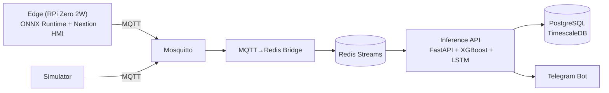

# PRATYAKSA: AIoT Predictive + Prescriptive Maintenance

Sistem AIoT Predictive + Prescriptive Maintenance untuk alat berat tambang PT. Kideco Jaya Agung. Arsitektur Edge-Cloud dengan XGBoost + LSTM MoE + Digital Twin + MLOps.

## Architecture



## Quick Start

```bash
cp .env.example .env
# edit .env → set POSTGRES_PASSWORD, TELEGRAM_*, PRATYAKSA_API_KEYS

docker compose --profile dev up -d

# verify
curl http://localhost:6000/health
```

## Services

| Port | Service | Description |
|------|---------|-------------|
| 6000 | API | Inference engine (predict/explain/workorder) |
| 6050 | MLflow | Experiment tracking |
| 6080 | Airflow | Retraining pipeline |
| 6001 | Grafana | Monitoring dashboard |
| 6090 | Prometheus | Metrics collection |
| 6883 | Mosquitto | MQTT broker |
| 6379 | Redis | Streams + cache |
| 5432 | PostgreSQL | TimescaleDB |

## Project Structure

```
├── api/                    Inference API (FastAPI)
│   └── app.py             Predict/Explain/Workorder endpoints
├── edge/                  Edge device (RPi Zero 2W)
│   ├── main.py            Sensor loop + MQTT
│   ├── inference.py       ONNX Runtime orchestrator
│   ├── risk_resolver.py   Risk resolver + Digital Twin
│   ├── preprocessor.py    Feature transform (37 fitur)
│   ├── buffer.py          SQLite offline buffer (72 jam)
│   ├── digital_twin.py    Physics model (brake/bearing/hydraulic)
│   └── drivers/           ADXL345, MAX6675, Pressure Transducer
├── bot/                   Telegram alert bot
├── simulator/             Stream simulator
├── airflow/dags/          Retrain pipeline
└── artifacts/             Models (XGBoost, LSTM, scaler, ONNX)
```

## API Endpoints

| Method | Path | Auth | Description |
|--------|------|------|-------------|
| POST | `/predict` | API Key | Single prediction |
| GET | `/explain/{prediction_id}` | API Key | SHAP waterfall plot (base64) |
| POST | `/workorder` | API Key | Prescriptive recommendation |
| GET | `/health` | None | Health check |
| GET | `/metrics` | None | Prometheus metrics |

## Environment Variables

| Variable | Required | Default | Description |
|----------|----------|---------|-------------|
| `POSTGRES_PASSWORD` | Yes | — | PostgreSQL password |
| `PRATYAKSA_API_KEYS` | Yes | — | Comma-separated API keys |
| `TELEGRAM_BOT_TOKEN` | Yes | — | Telegram bot token |
| `TELEGRAM_CHAT_ID` | Yes | — | Telegram chat ID |
| `ENV` | No | `development` | Environment mode |
| `GRAFANA_PASSWORD` | No | `pratyaksa2026` | Grafana admin password |

## Testing

```bash
# Unit tests
python test_core.py -v
python test_load.py

# Integration (stream → Redis → API)
curl -X POST -H "X-API-Key: $KEY" \
  -H "Content-Type: application/json" \
  -d '{"asset_id":"test-001","equipment_type":"haul_truck","features":[1.0]*37}' \
  http://localhost:6000/predict
```
